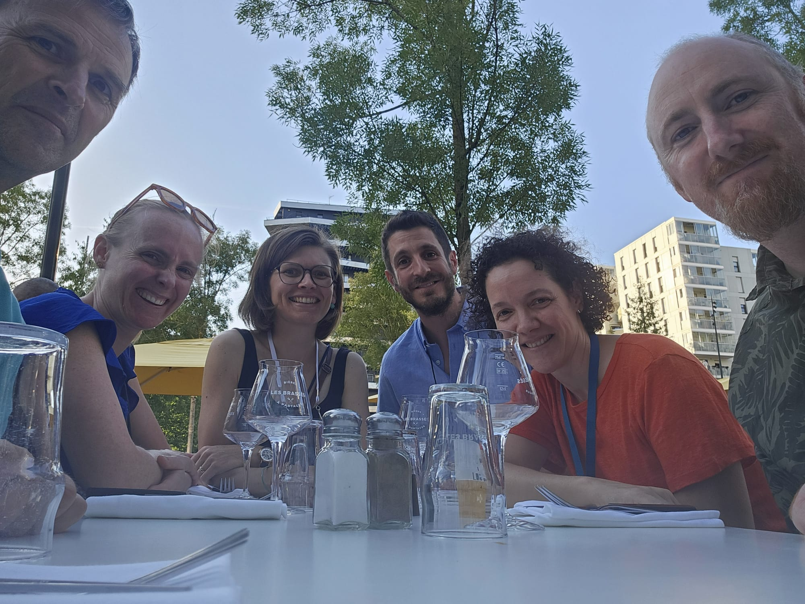

Le comité de pilote peut être contacté via [copil-rencontres-r@groupes.renater.fr](copil-rencontres-r@groupes.renater.fr).

Le comité de pilotage est constitué des personnes suivantes :

- [Julie Aubert](https://mia-ps.inrae.fr/julie-aubert) (2023 -) AgroParisTech
- [François Husson](https://husson.github.io/) (2011 -) Institut Agro Rennes-Angers
- [Jean-François Rey](https://jeff.biosp.org) (2025 -) INRAE
- [Maëlle Salmon](https://masalmon.eu/) (2025 -) rOpenSci
- [Aurélie Siberchicot](https://lbbe.univ-lyon1.fr/fr/annuaires-des-membres/siberchicot-aurelie) (2023 -) Lyon 1 Université
- [Aymeric Stamm](https://astamm.github.io/) (2026 - ) CNRS

{width="400px" fig-alt="Photo des membres du comite de pilotage" fig-align="center"}

Les anciens membres du comité de pilotage :

- Marie Chavent (2011 - 2023)
- Stéphane Dray (2014 - 2023)
- Rémy Drouilhet (2015 - 2026)
- Robin Genuer (2011 - 2025)
- Julie Josse (2011 - 2025)
- Benoît Liquet (2011 - 2023)
- Jérôme Saracco (2011 - 2015)
