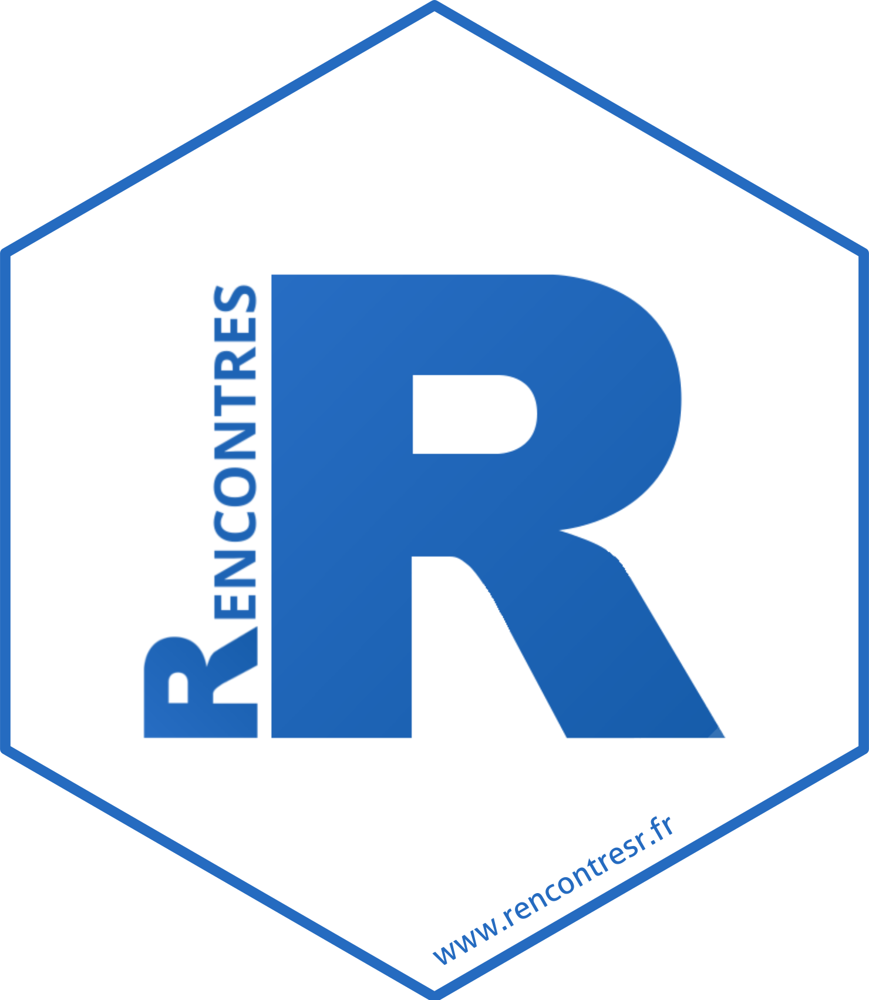

::: {.column-margin}
{width=200px}
:::

Depuis 2012, les **Rencontres R** constituent la plus grande manifestation francophone dédiée au langage [R](https://www.r-project.org/) et son écosystème, sous l’égide de la Société Française de Statistique ([SFdS](https://www.sfds.asso.fr/)). Les **Rencontres R** ont pour objectif d'offrir à la communauté francophone un lieu d'échange et de partage d'idées toutes disciplines confondues. La conférence réunit à chaque édition les principaux contributeurs de cette communauté très active et s'adresse aussi bien aux débutants qu'aux utilisateurs confirmés et expérimentés issus de tous les secteurs d'activités.

**Vous trouverez sur ce site**

-   L'édition [RR2026](posts/RR2026/index.qmd) à venir.

-   Les [éditions précédentes](rencontres.qmd).

-   Toutes informations sur cette confèrence et son organisation.

**Retrouver nous sur**

* [youtube](https://www.youtube.com/@RencontresR)  
* [linkedin](https://www.linkedin.com/groups/14126026/)  
* [github](https://github.com/Rencontres-R/Rencontres_R.git)  
