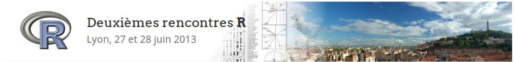
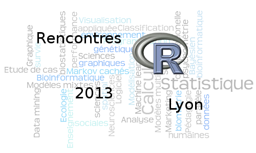

::: {.column-margin}
{width=200px}  


* [r2013-lyon.sciencesconf.org](https://r2013-lyon.sciencesconf.org)
* [Article dans le R Journal](https://journal.r-project.org/news/RJ-2013-2-siberchicot-dray/)
:::

Les 2e Rencontres R ont eu lieu à Lyon du 26 au 28 juin 2013 ([site web](https://r2013-lyon.sciencesconf.org)).

**Conférenciers invités**

- Karim Chine : *R and the Cloud* ([résumé](https://r2013-lyon.sciencesconf.org/19165/Abstract_RencontresR2013_Chine.pdf))

- Yvonnick Noël : *L'approche par comparaison de modèles avec R2STATS dans l'enseignement des statistiques en sciences humaines* ([résumé](https://r2013-lyon.sciencesconf.org/18927/ynoelR2013.pdf))

- Gilbert Ritschard : *TraMineR : Une boite à outils pour l'exploration et la visualisation de séquences* ([résumé](https://r2013-lyon.sciencesconf.org/19057/GR_resume_RR2013.pdf))

- Jérôme Sueur : *R as a sound system* ([résumé](https://r2013-lyon.sciencesconf.org/18000/JSueur_Abstract.pdf))

- Hadley Wickham : *Visualising big data in R* ([résumé](https://r2013-lyon.sciencesconf.org/19361/wickham_abstract.pdf))


**Tutoriels**

- Vincent Miele : *Parallel computing with R*

- Anne-Béatrice Dufour & Sylvain Mousset : *Writing a report with Sweave*

- Christophe Genolini : *Building an R package*

```{r set-up}
#| include: false
library(kableExtra)
```

```{r load-data}
#| include: false
programmes <- read.csv("../../data/tout.csv")
programme <- dplyr::filter(programmes, conference == "rr2013")
```
```{r prog}
#| echo: false
programme |> dplyr::select(auteurrices, titre, mots_cles) |>
          kable("html", caption = "Programme des rencontres") |>
  kable_styling(bootstrap_options = c("striped", "hover")) |>
  column_spec(1, color = spec_color(as.numeric(as.factor(programme$type))))
```
