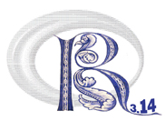

::: {.column-margin}
{width=150px}  


* [r2014-mtp.sciencesconf.org/](https://r2014-mtp.sciencesconf.org/)
:::


Les 3e Rencontres R ont eu lieu à Montpellier du 25 au 27 juin 2014 ([site web](https://r2014-mtp.sciencesconf.org/)).


**Conférenciers invités**

- Roger Bivand : *The R Development Process: status and prospects* ([résumé](https://r2014-mtp.sciencesconf.org/conference/r2014-mtp/pages/Bivand_1.pdf))

- Winston Chang : *Interactive graphics with ggvis* ([résumé](https://r2014-mtp.sciencesconf.org/conference/r2014-mtp/pages/chang.pdf))

- Thibaut Jombart : *Towards an open-source, unified platform for disease outbreak analysis* ([résumé](https://r2014-mtp.sciencesconf.org/conference/r2014-mtp/pages/jombart.pdf))

- Pierre Ratinaud : *Analyse et visualisation de données textuelles avec R et IRaMuTeQ.* ([résumé](https://r2014-mtp.sciencesconf.org/conference/r2014-mtp/pages/ratinaud.pdf))

- Olivier Roustant & Yves Deville : *Packages (Re)Dice_ pour les computer experiments* ([résumé](https://r2014-mtp.sciencesconf.org/conference/r2014-mtp/pages/roustant.pdf))


**Tutoriels**

- Thomas Verron : *Construction d’interfaces graphiques autonomes sous R*

- Milan Bouchet-Valat : *Construction de plugins Rcommander*


```{r set-up}
#| include: false
library(kableExtra)
```

```{r load-data}
#| include: false
programmes <- read.csv("../../data/tout.csv")
programme <- dplyr::filter(programmes, conference == "rr2014")
```
```{r prog}
#| echo: false
programme |> dplyr::select(auteurrices, titre, mots_cles) |>
          kable("html", caption = "Programme des rencontres") |>
  kable_styling(bootstrap_options = c("striped", "hover")) |>
  column_spec(1, color = spec_color(as.numeric(as.factor(programme$type))))
```
