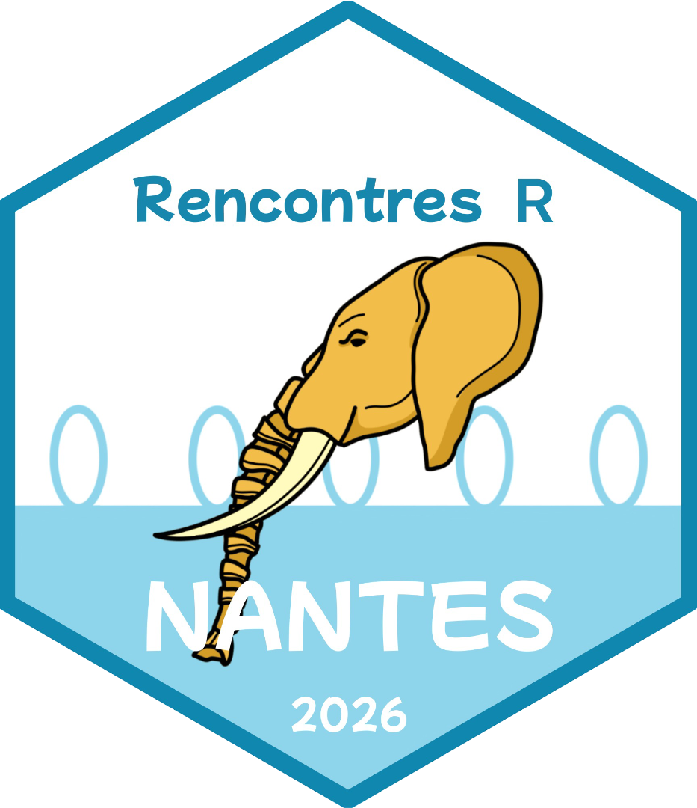

::: {.column-margin}
{width=150px}  


* [rr2026.sciencesconf.org](https://rr2026.sciencesconf.org/)
:::


Les 12e Rencontres R ont eu lieu à Nantes, du 16 au 18 juin 2026 ([site web](https://rr2026.sciencesconf.org/)).

**Conférenciers invités et conférencières invitées**

- Sébastien Plutniak : *disciplinR : modalités d'intervention intra-disciplinaires avec R. Réflexions depuis l'écosystème archeofrag pour l'analyse spatiale des fragmentations archéologiques* ([résumé](https://rr2026.sciencesconf.org/resource/page/id/9))

- Cara Thompson : *Bien plus qu'un beau graphique: créativité et accessibilité avec {ggplot2}* ([résumé](https://rr2026.sciencesconf.org/resource/page/id/9))

- Emilie Devijver : *Abstraction de graphes causaux* ([résumé](https://rr2026.sciencesconf.org/resource/page/id/9))

- Maëlle Salmon : *Plongée dans l’écosystème R* ([résumé](https://rr2026.sciencesconf.org/resource/page/id/9))

- Alain Danet : *Décrypter le rôle de la biodiversité pour le fonctionnement des écosystèmes: complémentarité, redondance, et les outils R pour une écologie reproductible* ([résumé](https://rr2026.sciencesconf.org/resource/page/id/9))


**Tutoriels**

- Christophe Dervieux & Maëlle Salmon : *PDF sans frictions : Typst dans vos projets Quarto*

- Sébastien Lê : *Introduction au tAIdyverse : l'analyse de données à l'R de l'intelligence artificielle*

- Marie Chion *Comprendre et traiter les valeurs manquantes dans R* -Reporté-  


```{r set-up}
#| include: false
library(kableExtra)
```

```{r load-data}
#| include: false
programmes <- read.csv("../../data/tout.csv")
programme <- dplyr::filter(programmes, conference == "rr2026")
```
```{r prog}
#| echo: false
programme |> dplyr::select(auteurrices, titre, mots_cles) |>
          kable("html", caption = "Programme des rencontres") |>
  kable_styling(bootstrap_options = c("striped", "hover")) |>
  column_spec(1, color = spec_color(as.numeric(as.factor(programme$type))))
```
